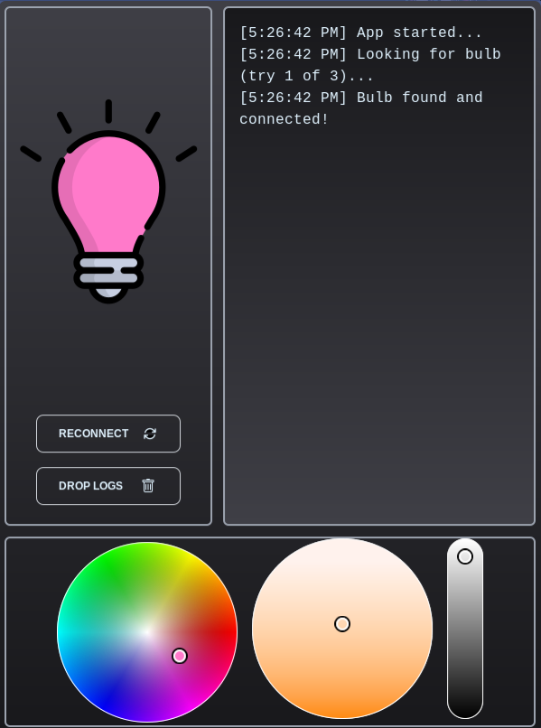
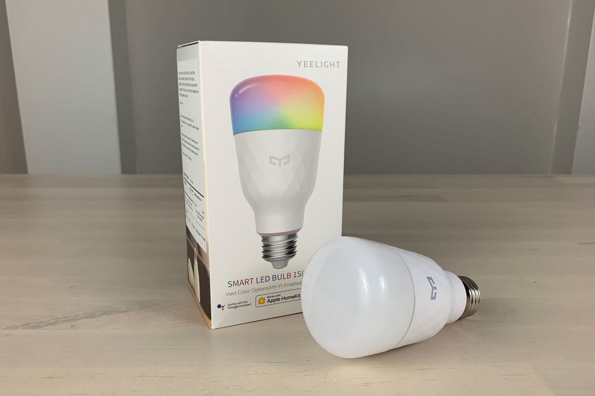

# 💡 Yeelight Controller

## 🤔 What and Why?

Some of you may had experience with this kind of devices : ([yeelight official website](https://en.yeelight.com/))

I have only one bulb, which I use as a background light for my working space. Most of the time **I just use one color** and sometimes have to **quickly switch** to the pure white during the calls. Feels like using mobile app is something I do not really want

> **Of course creating my own buggy app using whole bunch of fancy languages and frameworks is a simpler way 🤦!**

## 🕵️‍♂️ How does it work?

Yeelight has a [public API](https://www.yeelight.com/download/Yeelight_Inter-Operation_Spec.pdf), so firstly I implemented it in [Golang](https://github.com/vanyason/yeelight/blob/master/yeelight/yeelight.go)

> My solution is not the only one and mainly inspired by **(check this repoes)** [Repo 1](https://github.com/avarabyeu/yeelight) , [Repo 2](https://github.com/akominch/yeelight)

I used interesting project called [Wails](https://wails.io/) which is considered to be an **Electron** alternative written in **GO**. With **Wails** project suddenly became a frontend task, so **React** has been chosen as main frontend framework. I used [this colorpicker](https://iro.js.org/color_api.html), since it has a kelvin temperature feature.

Shortly: frontend - **REACT**, backend - **Wails (Yeelight API part implemented in GO)**

## ⚒️ How to build locally?

To build locally `git clone ...` the repo, follow the [Wails installation guide](https://wails.io/docs/gettingstarted/installation/) and finally just execute `wails dev` for local development and `wails build` for production build.

## 💭 Interesting Files

- There is a [bash script](https://github.com/vanyason/yeelight/blob/master/build/linux/generate_deb.sh) that creates deb package. This file is **not generated by Wails**
- There is a [test script](https://github.com/vanyason/yeelight/blob/master/examples/test.go) that tests your lightbulb. It sends all kind of commands and restores bulb to its initial state (hopefully)
- Commented part in [this file](https://github.com/vanyason/yeelight/blob/master/frontend/src/components/BulbButton.jsx) relates to a component`s fancy blur. It is commented due to lags on Linux, but you can try it yourself

## 📜 Todo

- [ ] Tests
- [ ] Automatic builds
- [ ] Fix bugs as they are discovered
- [ ] MacOS build
- [ ] Change UI to a more UX friendly one
- [ ] Rewrite in typescript
- [ ] Support multiple bulbs

**Estimation** : most likely never ⏳

---

##### 🧒 About ME and contact info

